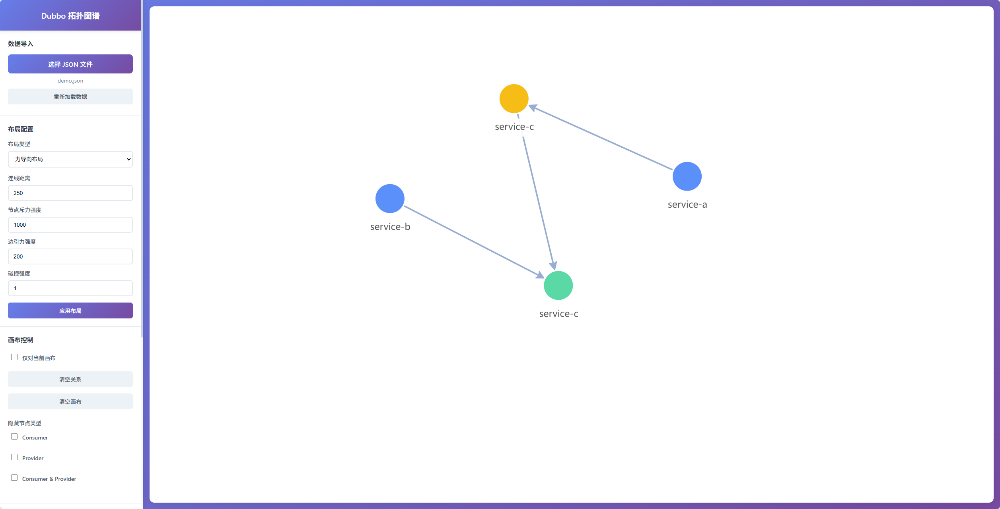
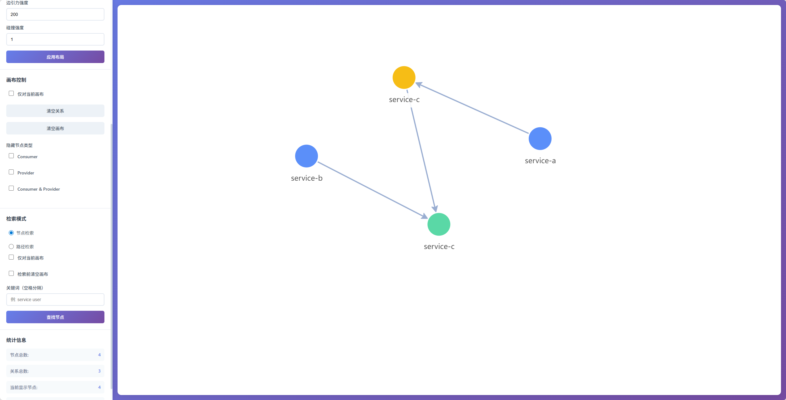

# Dubbo 集群网络拓扑图谱可视化工具

基于 AntV G6 5.0.50 开发的 Dubbo 集群网络拓扑关系可视化分析工具，提供强大的数据过滤、路径检索和高亮展示功能。

## 界面预览





## 功能特性

### 📊 数据导入与管理
- 支持上传 JSON 格式的 Dubbo 拓扑数据文件
- 自动解析并渲染网络拓扑图谱
- **重新加载数据**：一键恢复原始完整数据
- 数据验证与清洗，自动过滤无效关系

### 🎨 多种布局算法
- **力导向布局 (Force)** ⭐ 默认布局，适合展示复杂网络关系
  - 连线距离：250px（可调整 50-500）
  - 节点斥力强度：1000（可调整 100-5000）
  - 边引力强度：200（可调整 50-1000）
  - 碰撞强度：1（可调整 0-1）
- **层次布局 (Dagre)**：清晰展示层级结构
  - 支持 TB/BT/LR/RL 四个方向
  - 可调节节点间距和层级间距
- **环形布局 (Circular)**：节点均匀分布在圆周上
  - 默认半径：500px（可调整 100-1000）
  - 可设置起始/结束角度
- **网格布局 (Grid)**：规则的网格排列
  - 可自定义行数和列数
- **同心圆布局 (Concentric)**：同心圆分层展示
  - 支持节点大小和间距调整
  - 可选等距分布和防重叠

所有布局参数均支持实时调整和应用。

## 🎯 画布控制
- **仅对当前画布**：可选择只对当前显示的数据进行操作
- **清空关系**：
  - 未勾选"仅对当前画布"：移除所有关系，保留全部原始节点
  - 勾选"仅对当前画布"：只移除当前画布的关系，保留当前节点
- **清空画布**：清除所有节点和关系
- **隐藏节点类型**：选择性隐藏指定类型的节点
  - Consumer（消费者）
  - Provider（提供者）
  - Consumer & Provider（双角色）
  - 隐藏节点时保留相关连线，取消勾选即可恢复

## 🔍 智能检索系统

#### 节点检索
- **多关键词搜索**：支持空格分隔的多个关键词，全部匹配才显示
- **忽略大小写**：自动转换为小写进行匹配
- **检索范围选项**：
  - 未勾选"仅对当前画布"：在全部原始数据中搜索
  - 勾选"仅对当前画布"：仅在当前画布已显示的节点中搜索
- **显示模式**：
  - 勾选"检索前清空画布"：清空后只显示匹配结果
  - 未勾选：追加显示匹配节点，**高亮匹配的节点**（红色填充+粗边框），未匹配节点半透明显示

#### 路径检索
- **起始/目标节点**：通过关键词匹配节点
- **三种查找方向**：
  - **正向**：沿着边的方向从起点到终点
  - **反向**：逆着边的方向从起点到终点
  - **双向**：不考虑边的方向
- **最大跳数限制**：可设置路径最大长度（默认5跳），防止性能问题
- **检索范围选项**：
  - 未勾选"仅对当前画布"：在全部数据中查找路径
  - 勾选"仅对当前画布"：仅在当前画布的节点和边中查找路径
- **显示模式**：
  - 勾选"检索前清空画布"：清空后只显示路径相关节点和边
  - 未勾选：**高亮路径节点和边**（红色+粗线），未匹配元素半透明显示
- **性能优化**：
  - 限制最多显示100条路径
  - 异步处理，显示"搜索中..."提示
  - 自动防止内存溢出

### 📈 实时统计信息
- **节点总数**：原始数据中的节点总量
- **关系总数**：原始数据中的关系总量
- **当前显示节点**：画布上当前可见的节点数量
- **当前显示关系**：画布上当前可见的关系数量

### 🎨 高亮显示功能
- **高亮节点**：红色填充（#FF6B6B）+ 红色边框 + 加粗边框（3px）
- **高亮边**：红色（#FF6B6B）+ 加粗线条（3px）
- **非高亮节点**：半透明填充（40%透明度）+ 灰色标签
- **非高亮边**：半透明（40%透明度）+ 细线条（1px）

## 快速开始

### 方式一：使用 Docker（推荐）

#### 前置要求
- 安装 [Docker](https://www.docker.com/get-started)
- 安装 [Docker Compose](https://docs.docker.com/compose/install/)（Docker Desktop 已包含）

#### 快速启动

**使用启动脚本（最简单）**

Linux/macOS:
```bash
chmod +x start.sh
./start.sh
```

Windows:
```cmd
start.bat
```

**手动命令**

```bash
# 克隆项目
git clone <repository-url>
cd dubbo-relation-json-to-graph

# 使用 docker-compose 启动（推荐）
docker-compose up -d

# 或直接使用 Docker
docker build -t dubbo-topology .
docker run -d -p 3000:80 --name dubbo-topology-viewer dubbo-topology
```

浏览器访问 http://localhost:3000

#### Docker 常用命令

```bash
# 查看容器日志
docker-compose logs -f

# 停止服务
docker-compose down

# 重新构建并启动
docker-compose up -d --build

# 进入容器
docker exec -it dubbo-topology-viewer sh
```

### 方式二：本地开发环境

#### 前置要求
- Node.js >= 16.0.0
- npm >= 7.0.0

### 安装依赖

```bash
npm install
```

### 启动开发服务器

```bash
npm run dev
```

浏览器将自动打开 http://localhost:3000

### 构建生产版本

```bash
npm run build
```

### 预览生产构建

```bash
npm run preview
```

## 数据格式

JSON 数据格式示例：

```json
{
    "categories": [
        {
            "index": 0,
            "name": "consumer",
            "base": "consumer"
        },
        {
            "index": 1,
            "name": "provider",
            "base": "provider"
        },
        {
            "index": 2,
            "name": "consumer and provider",
            "base": "consumer and provider"
        }
    ],
    "links": [
        {
            "source": 1,
            "target": 3
        },
        {
            "source": 0,
            "target": 2
        },
        {
            "source": 2,
            "target": 3
        }
    ],
    "nodes": [
        {
            "index": 0,
            "name": "service-a",
            "category": 0
        },
        {
            "index": 1,
            "name": "service-b",
            "category": 0
        },
        {
            "index": 2,
            "name": "service-c",
            "category": 2
        },
        {
            "index": 3,
            "name": "service-c",
            "category": 1
        }
    ]
}
```

## 技术栈

- **前端框架**: 原生 JavaScript (ES6+)
- **图可视化**: AntV G6 v5.0.50
- **构建工具**: Vite v5.0.0
- **样式**: 原生 CSS3

# 交互说明

### 基础操作
1. **拖拽画布**：鼠标左键按住空白处拖动
2. **缩放视图**：鼠标滚轮上下滚动
3. **拖拽节点**：拖动节点可调整位置（不影响布局算法）
4. **悬停查看**：鼠标悬停在节点上查看详细信息（类型、名称）

### 使用流程
1. **加载数据**：点击"选择 JSON 文件"上传 Dubbo 拓扑数据
2. **选择布局**：从5种布局算法中选择，默认为力导向布局
3. **调整参数**：根据数据规模调整布局参数，点击"应用布局"生效
4. **过滤数据**：
   - 使用"隐藏节点类型"快速过滤不需要的节点
   - 使用"清空关系"移除所有连线，聚焦节点分析
5. **检索分析**：
   - 使用"节点检索"快速定位目标服务
   - 使用"路径检索"分析服务间的调用链路
   - 勾选"仅对当前画布"进行渐进式过滤
6. **恢复数据**：点击"重新加载数据"恢复完整原始数据

### 高级技巧
- **渐进式过滤**：先用节点检索筛选出感兴趣的服务，勾选"仅对当前画布"，再进行路径检索
- **高亮对比**：不勾选"检索前清空画布"，利用高亮效果对比匹配和未匹配的元素
- **性能优化**：数据量大时，适当限制路径检索的最大跳数

## 项目结构

```
dubbo-relation-json-to-graph/
├── index.html          # 主页面，包含UI布局和元素定义
├── style.css           # 样式文件，定义界面外观
├── main.js             # 核心逻辑，包含G6图谱、布局、检索等功能
├── demo.json           # 示例数据文件
├── package.json        # 项目依赖配置
├── vite.config.js      # Vite 开发服务器配置
├── Dockerfile          # Docker 镜像构建文件
├── docker-compose.yml  # Docker Compose 配置文件
├── nginx.conf          # Nginx 服务器配置
├── .dockerignore       # Docker 构建忽略文件
├── start.sh            # Linux/macOS 快速启动脚本
├── start.bat           # Windows 快速启动脚本
└── .gitignore          # Git 版本控制忽略文件
```

## Docker 部署说明

### 构建策略
项目使用**多阶段构庻**，优化镜像大小：

1. **构庻阶段** (node:18-alpine)
   - 安装项目依赖
   - 执行 Vite 构建，生成静态文件
   
2. **生产阶段** (nginx:alpine)
   - 使用轻量级 Nginx 提供静态文件服务
   - 最终镜像大小约 20-30MB

### 端口配置
- 容器内部端口：80
- 对外映射端口：3000（可修改 docker-compose.yml 中的 ports 配置）

### 环境变量
当前无需额外环境变量，所有配置均为静态构建。

### 性能优化
- **Gzip 压缩**：启用 JS/CSS/JSON 等文件压缩
- **静态资源缓存**：1年缓存期，提升加载速度
- **安全头部**：添加 X-Frame-Options、X-XSS-Protection 等安全头

### 生产环境部署建议

1. **使用反向代理**：建议在生产环境中使用 Nginx 或 Traefik 作为反向代理
2. **HTTPS 配置**：使用 Let's Encrypt 配置 SSL 证书
3. **资源限制**：通过 docker-compose 设置内存和 CPU 限制

```yaml
services:
  dubbo-topology:
    deploy:
      resources:
        limits:
          cpus: '0.5'
          memory: 256M
        reservations:
          cpus: '0.25'
          memory: 128M
```

### 故障排除

**问题：容器启动但无法访问**
- 检查端口映射：`docker ps` 查看端口是否正确
- 检查防火墙：确保 3000 端口允许访问

**问题：构建失败**
- 检查 Docker 版本：确保 Docker >= 20.10
- 清理缓存：`docker system prune -a`

**问题：页面白屏**
- 查看容器日志：`docker logs dubbo-topology-viewer`
- 检查 Nginx 配置：`docker exec dubbo-topology-viewer cat /etc/nginx/conf.d/default.conf`

## 核心特性说明

### 数据验证与清洗
- 自动检测并过滤引用不存在节点的边
- 加载时显示过滤的无效关系数量
- 确保图谱渲染的稳定性

### 性能优化措施
- **路径检索优化**：
  - 使用 BFS 算法进行路径查找
  - 限制单次搜索最多100条路径
  - 限制每对节点最多20条路径
  - 异步处理，防止UI阻塞
  - 队列大小限制，防止内存溢出
- **布局参数优化**：
  - 力导向布局默认参数经过优化，防止节点聚集
  - 所有布局都设置了合理的默认值

### 兼容性
- 基于 G6 5.x 最新API开发
- 支持现代浏览器（Chrome, Firefox, Edge, Safari）
- 响应式设计，自动适应窗口大小

## License

MIT
